<h1 align="center">DVCON Hackathon: CNN Edge Vision Accelerator</h1>

<h3 align="center">High-Performance, AXI4-Integrated FPGA Hardware Accelerator for 3x3 Convolution, ReLU, and Max Pooling</h3>

<div align="center">


</div>

---

## 🛑 Problem Statement

**What problem exists:** Real-time image processing and early-stage CNN layers (like 3x3 Convolution, ReLU, and Max Pooling) are computationally expensive when executed sequentially on standard CPUs. 
**Why it matters:** Edge computing devices require low latency and high energy efficiency for tasks such as autonomous driving, robotics, and smart surveillance.
**Who faces the problem:** Embedded systems engineers and AI researchers attempting to deploy vision models on edge devices with strict power and timing budgets.
**Current limitations:** Software-based approaches on embedded CPUs suffer from high latency (e.g., >138,000 ns per tile) and high power consumption.
**Real-world impact:** By offloading these foundational vision tasks to custom FPGA hardware, we can achieve massive speedups, enabling real-time decision-making in safety-critical edge applications.

---

## 💡 Our Solution

**How our solution solves the problem:** We designed a fully pipelined, AXI4-compliant hardware accelerator in Verilog. It streams pixel data directly from DDR memory, applies a 3x3 sliding window convolution, executes a Rectified Linear Unit (ReLU) activation, and performs Max Pooling—all in a continuous, 1-cycle latency pipeline.
**What makes it unique:** Instead of relying on a soft-core processor, our solution features a custom `axi4_master` for burst-read DMA from memory and an `axi4_slave` for control registers, orchestrated by a custom `sequencer`.
**Key innovations:**
* Line buffer matrix utilizing FPGA BRAM for seamless sliding window generation without redundant memory fetches.
* Perfectly synchronized control and data paths ensuring zero pipeline bubbles during continuous streaming.
**Why judges should care:** We demonstrated a massive **97.31x speedup** in hardware simulation over an equivalent software implementation, proving the viability of our RTL design.

---

## ✨ Key Features

| Feature | Description | Benefits |
| :--- | :--- | :--- |
| **AXI4 Master/Slave Interface** | Standardized AXI4 memory mapped interfaces. | Plug-and-play integration with Xilinx Zynq / MicroBlaze ecosystems. |
| **BRAM Line Buffers** | On-chip block RAM for caching image rows. | Minimizes off-chip memory bandwidth by reusing overlapping pixels. |
| **Pipelined Datapath** | Streaming 3x3 Conv -> ReLU -> Max Pooling. | High throughput, capable of processing one pixel per clock cycle. |
| **Python Verification** | Golden model implemented in Python. | Enables rapid verification and exact cycle/latency benchmarking. |

---

## 🎥 Project Demo

* **Demo Video:** `[Insert YouTube Link Here]`
* **Presentation:** `[Insert Pitch Deck Link Here]`
* **Poster:** `[Insert Poster Link Here]`
* **GitHub:** `[Insert Repo Link Here]`

---

## 🏛️ Architecture Diagram

```mermaid
graph TD
    subgraph AXI System Interconnect
        M[DDR Memory / MIG] <--> |AXI4 Master| TOP[dvcon_top]
        CPU[Host CPU / VEGA] <--> |AXI4 Slave| TOP
    end

    subgraph dvcon_top (Top Module)
        AM[axi4_master] --> |Pixel Stream| AT[Accelerator_Top]
        AS[axi4_slave] --> |Control/Status| SEQ[dvcon_sequencer]
        SEQ --> |Read Commands| AM
        SEQ --> |Start/Done| AS
        AT --> |Result Data| SEQ
    end

    subgraph Accelerator_Top
        AT_IN[pixel_bus] --> LB[FPGA_BRAM_line_buffers]
        LB --> WG[Window_Generator]
        WG --> MAC[MAC_Convolution]
        MAC --> RELU[ReLU Activation]
        RELU --> MP[Max_Pooling]
        MP --> OB[Output_BRAM]
    end
```

---

## 🔄 Workflow Diagram

```mermaid
flowchart LR
    A[Host configures Address] --> B[Host sets START bit]
    B --> C[Sequencer triggers AXI Master]
    C --> D[AXI Master burst reads DDR]
    D --> E[Line Buffers fill]
    E --> F[3x3 Window extracted]
    F --> G[MAC Convolution]
    G --> H[ReLU]
    H --> I[Max Pooling]
    I --> J[Output BRAM]
    J --> K[Sequencer signals DONE]
    K --> L[Host reads Results]
```



---

## 📂 Folder Structure

```text
DVCON/
│
├── accelaration_speed_check/    # Python golden model and speed benchmarking
│   ├── speed_check.py           # Python script calculating software inference time
│   └── speed achived .txt       # Results showing 97.31x speedup
│
├── simulation_files/            # Testbenches and input stimuli for RTL simulation
│   ├── test_bench.v             # Primary Verilog testbench
│   ├── image_rgb.bin            # Raw binary input image data
│   └── test_img.jpg             # Reference input image
│
├── source_files/                # Core RTL Verilog source files
│   ├── the hierarchy of the modules.txt # Text representation of RTL hierarchy
│   └── verilog files/           # All design modules
│       ├── top_module.v         # System top integrating AXI interfaces & accelerator
│       ├── accelarator_top.v    # Wrapper for the CNN pipeline
│       ├── axi4_master.v        # DMA memory read engine
│       ├── axi4_slave.v         # Register file for host communication
│       ├── sequencer.v          # FSM controlling AXI master and slave
│       ├── FPGA_BRAM_line_buffers.v # Row caching for sliding window
│       ├── Window_Generator.v   # 3x3 pixel extraction
│       ├── MAC_Covolution.v     # Multiply-Accumulate block
│       ├── Relu.v               # Rectified Linear Unit
│       ├── Max_Pooling.v        # Pooling layer logic
│       ├── Output_Bram.v        # Storage for final feature map
│       └── ddr_model.v          # Simulation model for DDR memory
│
└── tool/                        # Tool-specific scripts (e.g., Vivado)
    ├── test_bench.tcl           # Tcl script for running the simulation
    └── tb_dvcon_top_behav.wdb   # Waveform database for viewing in Vivado
```

---

## 🛠️ Technologies Used

| Technology | Purpose | Version |
| :--- | :--- | :--- |
| **Verilog-2001** | Hardware Description Language for RTL design | IEEE 1364-2001 |
| **Python** | Software benchmarking and Golden Model | 3.8+ |
| **NumPy** | Array manipulation in Python benchmark | Latest |
| **Xilinx Vivado** | Synthesis, Implementation, and Simulation | 2022.2+ |

---

## 💻 Software Requirements

* **Operating System:** Windows 10/11 or Ubuntu 20.04/22.04 LTS
* **Python Version:** 3.8 or higher
* **Simulation Tool:** Xilinx Vivado / ModelSim / Verilator
* **RAM:** Minimum 8GB (16GB recommended for Vivado synthesis)

---

## ⚙️ Hardware Requirements (For Deployment)

* **FPGA:** Xilinx Zynq-7000 or Zynq UltraScale+ MPSoC (e.g., PYNQ-Z2, ZCU104)
* **Memory:** DDR3/DDR4 for image storage
* **Interfaces:** AXI4 standard interface

---

## 🚀 Installation & Running the Project

### 1. Running the Software Benchmark (Python)

```bash
# Clone the repository
git clone <repository_url>
cd DVCON/accelaration_speed_check

# Ensure NumPy is installed
pip install numpy

# Run the speed check
python speed_check.py
```

### 2. Running the RTL Simulation (Vivado)

1. Open Xilinx Vivado.
2. Create a new project and add all files from `source_files/verilog files/`.
3. Add `simulation_files/test_bench.v` as the simulation source.
4. Ensure `image_rgb.bin` is placed in the Vivado simulation run directory.
5. In the Vivado Tcl Console, source the provided script:
```tcl
cd tool/
source test_bench.tcl
```
6. Observe the waveform outputs.

---

## 🔧 Configuration

* **AXI Data Width:** Parameterized to 64-bit (`DATA_WIDTH=64`).
* **AXI Address Width:** Parameterized to 64-bit (`ADDR_WIDTH=64`).
* **Image Dimensions:** The testbench is configured to read `image_rgb.bin` which represents the input feature map.
* **Kernel:** Hardcoded 3x3 weights in `MAC_Covolution.v` (Sobel/Edge detection pattern).

---

## 📥 Input Format

* **Software:** Binary file `image_rgb.bin` containing flattened 8-bit unsigned integer pixel data.
* **Hardware:** The `axi4_master` expects pixel data to be laid out linearly in DDR memory. It reads 64-bit words (8 pixels at a time) and streams them to the accelerator.

---

## 📤 Output Format

* **Software:** Terminal output displaying execution time and speedup.
* **Hardware:** The final feature map is stored in the `Output_Bram.v` module, which can be read back by the Host CPU via the `axi4_slave` interface (reading the `result_score` register after `done` is asserted).

---

## 📊 Sample Outputs

### Terminal Output (speed_check.py)
```text
Software time: 138183.6 ns
Speedup vs FPGA (1420ns): 97.31x
```

---

## 🧠 RTL Pipeline Explanation

1. **Line Buffers (`FPGA_BRAM_line_buffers.v`):** Caches two full rows of the incoming image. As the third row streams in, we have access to a 3-row vertical slice.
2. **Window Generator (`Window_Generator.v`):** Takes the 3 rows and outputs a 3x3 pixel window (9 pixels, 8-bits each) every clock cycle.
3. **MAC (`MAC_Covolution.v`):** Multiplies the 9 pixels by the kernel weights and accumulates the result in a single pipeline stage.
4. **ReLU (`Relu.v`):** Clips any negative convolution results to zero.
5. **Max Pool (`Max_Pooling.v`):** Performs spatial downsampling.
6. **Output BRAM (`Output_Bram.v`):** Stores the processed pixels for the host to retrieve.

---

## 📈 Evaluation Metrics & Performance Results

| Metric | Software (Python/CPU) | Hardware (FPGA/RTL) | Improvement |
| :--- | :--- | :--- | :--- |
| **Latency per batch** | 138,183.6 ns | 1,420 ns | **~97x Faster** |
| **Throughput** | Low | 1 Pixel / Clock (Post-latency) | Maximum |
| **Pipeline Bubbles** | N/A | 0 | Ideal |

---

## 🖼️ Screenshots

> **Note:** Replace these placeholders with actual screenshots from your project.

| Vivado Simulation Waveform | Architecture Diagram |
| :---: | :---: |
| `[Insert tb_dvcon_top_behav waveform screenshot]` | `[Insert block diagram]` |

---

## 🚀 Future Improvements

* **Programmable Weights:** Transition from fixed kernel weights in `MAC_Covolution.v` to AXI-lite programmable registers.
* **Scalable Dimensions:** Make the line buffer depth dynamically configurable via host software for different image resolutions.
* **Multi-Layer Support:** Cascade multiple `Accelerator_Top` modules to form a deep pipeline.

---

## 🚧 Challenges Faced

* **AXI4 Synchronization:** Ensuring the `axi4_master` data valid signals perfectly aligned with the pipelined BRAM line buffers required careful clock-cycle counting.
* **Handling Pipeline Latency:** Managing the `valid` signals through the MAC, ReLU, and Pooling stages so that the Output BRAM only captures valid feature map data.

---

## 📚 Learnings

* Deep understanding of the AXI4 Full protocol for high-throughput DMA transfers.
* Techniques for continuous data streaming in FPGA pipelines without stalling (zero bubble pipelines).
* Hardware-software co-verification methodologies using Python golden models and binary file I/O in Verilog testbenches.

---

## 👨‍💻 Team

* **[Your Name/Team Name]** - DVCON Hackathon Participant

---

## 🙏 Acknowledgements

* **DVCON Hackathon Organizers** for the problem statement and platform.
* Xilinx documentation for AXI4 specifications.

---

## 📜 License

This project is licensed under the MIT License - see the LICENSE file for details.

---

## 📞 Contact

* **GitHub:** `[Your GitHub Profile]`
* **LinkedIn:** `[Your LinkedIn Profile]`
* **Email:** `[Your Email]`

---

## 📘 Appendix & File-by-File Explanation

### Core Modules
* **`top_module.v`**: The absolute top level. It instantiates the AXI Master, AXI Slave, Sequencer, and Accelerator. It bridges the outside world to the processing core.
* **`axi4_master.v`**: Acts as a DMA controller. When told to start, it issues burst read requests to the DDR memory and pushes the returned data to the accelerator.
* **`axi4_slave.v`**: The control plane. The host processor (e.g., ARM Cortex-A9) writes to this module's registers to set the image address and start the process.
* **`sequencer.v`**: The brain of the operation. It waits for the start signal from the slave, triggers the master to read data, monitors the accelerator, and asserts the done flag back to the slave.
* **`accelarator_top.v`**: A wrapper strictly for the math pipeline (Line Buffers -> Window Gen -> MAC -> ReLU -> Pool -> BRAM).
* **`MAC_Covolution.v`**: Performs 9 multiplications and a tree-addition in combinational logic, registering the result.

### Build Process
The design is purely RTL. Synthesis is handled by standard FPGA EDA tools (Vivado/Quartus). No complex software cross-compilation is required, except running the Python verification script.

---

## ⚖️ Judge Friendly Section: Quick Evaluation Guide

**How to evaluate in under 2 minutes:**
1. **Verify Software Speed:** Open a terminal in `accelaration_speed_check/` and run `python speed_check.py`.
   * **Expected Output:** You will immediately see `Software time: 138183.6 ns` and `Speedup vs FPGA (1420ns): 97.31x`.
2. **Verify Hardware Correctness:** Look inside `simulation_files/` and `tool/tb_dvcon_top_behav.wdb`. This waveform database contains the completed RTL simulation proving the pipeline processes the image perfectly in 1420ns.
3. **Inspect the Architecture:** Open `source_files/verilog files/accelarator_top.v`. Note the clean, modular instantiation of `FPGA_BRAM_line_buffers`, `Window_Generator`, `MAC_Convolution`, `Relu`, and `Max_pooling`. It is a textbook example of a high-throughput systolic pipeline.

---

## 🛠️ Troubleshooting

* **File Not Found in Python:** Ensure you run `python speed_check.py` from *inside* the `accelaration_speed_check` directory so it can find `image_rgb.bin`.
* **Vivado Simulation Fails to Read Input:** Verilog's `$readmemh` or `$fread` (inside `test_bench.v`) requires the path to `image_rgb.bin` to be correct relative to the Vivado simulation working directory. If it reads all zeros, copy the `.bin` file to your `sim_1/behav/xsim` folder.

---

## ❓ FAQ

**Q: Why use a custom AXI4 Master instead of Xilinx AXI DMA IP?**
A: To minimize resource utilization and demonstrate a deeper understanding of AMBA protocols. Our custom master is heavily optimized specifically for 2D image fetching.

---

## 📐 Design Decisions

* **Fixed Kernel vs Programmable:** For this hackathon iteration, we hardcoded the Sobel/Edge kernel in RTL. This allowed the synthesizer to aggressively optimize the multipliers into shifts and adds, saving DSP slices.
* **BRAM Line Buffers:** Chose Block RAM over distributed RAM for the line buffers to support higher resolution images without exhausting slice logic.

---

## 📈 Scalability

The `DATA_WIDTH` and `ADDR_WIDTH` are parameterized in the top-level modules. By adjusting the BRAM depth in `FPGA_BRAM_line_buffers.v`, the design scales effortlessly from 32x32 patches to 1080p video streams.

---

## 🛡️ Security Considerations

As this is a bare-metal hardware accelerator, security is delegated to the host system (e.g., TrustZone on the ARM core). However, the `axi4_slave` implements strict address decoding to prevent out-of-bounds register accesses.

---

## 📦 Repository Statistics

* **Languages:** Verilog (95%), Python (5%)
* **Hardware Modules:** 12
* **Total Folders:** 5
* **Total Files:** 19 (excluding Vivado temp files)

---

## 🛤️ Code Flow

1. CPU writes base address to `axi4_slave` and asserts `start`.
2. `axi4_slave` alerts `sequencer`.
3. `sequencer` instructs `axi4_master` to begin burst reads.
4. `axi4_master` pulls data from DDR and pushes to `accelarator_top` (`pixel_valid`, `pixel_bus`).
5. Data ripples through `Line Buffers` -> `Window Gen` -> `MAC` -> `ReLU` -> `Pool` -> `Output BRAM`.
6. Once expected pixels are processed, `sequencer` asserts `done` to `axi4_slave`.
7. CPU reads `done` flag, then bursts reads the result from `Output BRAM` via the slave/sequencer datapath.
# DVCON-Hackathon

